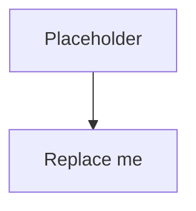

# Architecture

<!-- TODO: longer-form architecture writeup, separate from the README's
short version. This is where you go deep on:
  - the two-network split (plex-public vs plex-private)
  - why the subnet router needs both networks
  - the path a packet takes from your laptop to Sonarr
  - the path a packet takes from a Plex client to Plex
  - why no `ports:` block on the *arr services is the actual security move
  - what's protecting what (Tailscale identity vs Plex account auth)
-->

## Network Topology

## Packet Walks

<!-- TODO:
### Laptop reaches Sonarr (private path)
1. Laptop sends packet to 172.30.0.10:8989
2. ...

### Plex client streams a movie (public path)
1. ...
-->

## Security Model

<!-- TODO:
- What an attacker on the public internet sees (very little)
- What an attacker who has tailnet access sees (governed by ACL)
- What an attacker who compromises a single container sees (still bounded by ACL)
- Compared to: reverse proxy + basic auth, reverse proxy + OIDC, port-forwarding
-->
