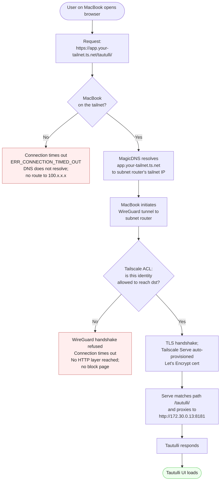

# Secure your Plex Software Stack with Tailscale

> Applications like Sonarr/Radarr/Prowlarr are companion applications that support the Plex Media Server environment. These applications are not built to be openly deployed over the internet - they are open source and built for homelab enthusiasts. Accessing these applications remotely while staying secure can be hard, but Tailscale's Subnet Router can help expose them securely.
> No more port fowarding or Reverse Proxy to expose the admin UI's - reduce your attack surface and stay secure!


## The Architecture

The majority of deployments use Docker, a containerization application host. Each container gets its own private IP on an internal NAT range and by default accept connections from anywhere. Many users utilize a firewall, like UFW, which requires exposing the ports those applications use by poking a hole in the firewall.

### Typical Server Example Setup:

```text
Docker
├── Plex Media Server  (app.plex.tv/desktop)
├── Sonarr             (myDomain.com:8989)
├── Radarr             (myDomain.com:7878)
├── Prowlarr           (myDomain.com:9696)
└── Tautulli           (myDomain.com:8181)

UFW (allowed inbound)
├── 32400/tcp   Plex
├── 8989/tcp    Sonarr
├── 7878/tcp    Radarr
├── 9696/tcp    Prowlarr
├── 8181/tcp    Tautulli
└── 22/tcp      SSH
```

With Tailscale, you no longer need to expose the admin application ports to the internet. Access is handled via the Tailscale infrastructure, and access is gated on Tailscale instead of locally in each application. Once this is enabled, you can disable authentication completely for the admin applications, as they are only accessable via the Tailnet.

### Tailscale Based Server Example Setup:

```text
Docker
├── Plex Media Server  (app.plex.tv/desktop)
├── Sonarr             (http://172.30.0.10:8989)
├── Radarr             (http://172.30.0.11:7878)
├── Prowlarr           (http://172.30.0.12:9696)
├── Tautulli           (http://172.30.0.13:8181)
└── ts-subnet-router

UFW (allowed inbound)
├── 32400/tcp   Plex
└── 22/tcp      SSH
```

BUT....

We have to use IP addresses and ports. Bleh! Thankfully, Tailscale has a great solution: Tailscale Serve can proxy internal IP requests to a DNS hostname. Additionally, while we reduced the amount of holes in our firewall from 6 --> 2, we can further decrease our attack posture by moving SSH onto the Tailnet too. 

### Tailscale Serve ENHANCED Server Example Setup:

```text
Docker
├── Plex Media Server  (app.plex.tv/desktop)
├── Sonarr             (https://app.your-tailnet.ts.net/sonarr/)
├── Radarr             (https://app.your-tailnet.ts.net/radarr/)
├── Prowlarr           (https://app.your-tailnet.ts.net/prowlarr/)
├── Tautulli           (https://app.your-tailnet.ts.net/tautulli/)
└── ts-subnet-router

UFW (allowed inbound)
└── 32400/tcp   Plex

systemd
└── tailscaled.service
```

    

> [!TIP]
> If the user device is not on the tailnet, or they are not authorized to access the resource, they will experience a timeout. This is intentional and expected, as there is no need to let the user know the service is active if they are not authorized.

## High Level Plan

This is the order of operations for getting from a typical Plex deployment to a Tailscale-secured one. Each phase builds on the previous, and you can stop at any phase if the value is already enough for your use case.

### 1. Install and enable Tailscale on the host

Get your host onto the tailnet and enable Tailscale SSH. Once Tailscale SSH is running in parallel with your existing SSH for a week or two and you're confident nothing depends on the public path, you can remove port 22 from your firewall entirely.

- Install Tailscale via your package manager
- Run `sudo tailscale up --ssh` to join the tailnet with SSH enabled
- Verify with `tailscale status` and test `tailscale ssh user@hostname` from another device on your tailnet

Docs:
- [Install Tailscale](https://tailscale.com/docs/install)
- [Tailscale SSH](https://tailscale.com/docs/features/tailscale-ssh)

### 2. Deploy the subnet router container

Bring up the `ts-subnet-router` container, which bridges your private Docker network to your tailnet. This is what makes Sonarr/Radarr/Prowlarr/Tautulli reachable to your tailnet without exposing them publicly.

- Define a dedicated private Docker network (e.g. `172.30.0.0/24`) for the apps you want to secure
- Run the `tailscale/tailscale` container with `TS_AUTHKEY` and `TS_ROUTES=172.30.0.0/24` set
- Enable IP forwarding inside the container (`net.ipv4.ip_forward=1`)
- Approve the advertised route in the Tailscale admin console (or use auto-approvers in your ACL to skip this step on future restarts)

Docs:
- [Subnet routers](https://tailscale.com/docs/features/subnet-routers)

### 3. Define the ACL policy

Write the policy file that decides which tailnet identities (you, family, future contractors) can reach which services on which ports. This replaces per-app basic auth with a single, version-controlled rule set.

- Author `acl.hujson` with `groups`, `tagOwners`, `autoApprovers`, `acls`, and `ssh` blocks
- Upload via the admin console, or wire up Tailscale's native GitOps sync to push from this repo on every commit
- Verify rules with `tailscale debug acl-check` before relying on them

Docs:
- [Policy file syntax](https://tailscale.com/docs/reference/syntax/policy-file)
- [ACL examples](https://tailscale.com/docs/reference/examples/acls)

### 4. Configure Tailscale Serve

Replace IP-and-port URLs (`http://172.30.0.10:8989`) with friendly HTTPS hostnames (`https://app.your-tailnet.ts.net/sonarr/`), backed by auto-provisioned Let's Encrypt certs. No reverse proxy needed.

- Author a serve config JSON that maps paths (`/sonarr/`, `/radarr/`, etc.) to the *arr container IPs and ports
- Mount the serve config into the subnet router container so it's picked up at startup
- Set the `URL Base` config on each *arr app to match its path prefix (`/sonarr`, `/radarr`, etc.) so internal links resolve correctly
- Verify each app loads at `https://app.your-tailnet.ts.net/<app>/` from a device on the tailnet

Docs:
- [Tailscale Serve](https://tailscale.com/docs/features/tailscale-serve)

## Quick Start

```bash
# TODO: clone + env + up
git clone https://github.com/Logvin/secure-plex-with-tailscale.git
cd secure-plex-with-tailscale
cp .env.example .env
# Edit .env with your Tailscale auth key
docker compose up -d
```

## What's Running

<!-- TODO: short table of services.
| Service | Purpose | Reachable from |
|---|---|---|
| plex | media server | public (plex.tv account auth) |
| sonarr | TV management | tailnet only |
| radarr | movie management | tailnet only |
| prowlarr | indexer manager | tailnet only |
| ts-subnet-router | exposes private Docker network to tailnet | n/a |
| ts-ssh-sidecar | Tailscale SSH gateway for the host | tailnet only |
-->

## Accessing Your Stack

<!-- TODO:
- Public Plex: same as always, via plex.tv account or LAN IP
- Private *arr stack:
  - From any device on your tailnet
  - Hit the Docker container IPs (e.g. http://172.30.0.10:8989 for Sonarr)
  - OR set up MagicDNS entries / hosts file shortcuts
- Tailscale SSH:
  - tailscale ssh root@ts-ssh-sidecar
-->

## The ACL Policy

<!-- TODO: walk through acl.hujson and explain:
- groups (you, family, guests)
- tags (server-admin, plex-only)
- rules (who can reach what, on which ports)
- why this beats per-app basic auth -->

## Verifying the Security Boundary

<!-- TODO: the proof-it-works section.
- Show that the *arr admin UIs are NOT reachable from a device not on
  the tailnet (curl from outside times out)
- Show that they ARE reachable from a tailnet device
- Show that Plex still works for streaming from outside
- Optional: tcpdump or ss to prove ports aren't published to the host
-->

## How This Compares to Other Approaches

<!-- TODO: short, honest comparison table.
| Approach | Pro | Con |
|---|---|---|
| Reverse proxy + basic auth | Easy | Admin UIs still on public internet |
| Reverse proxy + OIDC (Authelia/Authentik) | Strong SSO | Public DNS exists; CVE in the *arr is still a CVE in your edge |
| Tailscale (this guide) | Removes services from public internet entirely; identity-based access | Requires Tailscale client on every device that needs access |
-->

## Teardown

```bash
docker compose down -v
# TODO: any cleanup beyond docker compose down
```

## License

MIT. See [LICENSE](LICENSE).

---

<!-- TODO: footer / author / link to Tailscale docs you found most useful -->
