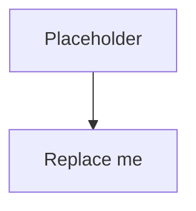

# Secure your Plex Software Stack with Tailscale

> Move Sonarr, Radarr, Prowlarr, and the rest of your admin UIs off the
> public internet. Keep them reachable from your laptop and phone. Stop
> worrying about CVEs in software that wasn't built for the public web.

<!-- TODO: one-paragraph intro that frames the problem.
The audience is a homelab operator running the *arr stack in Docker
who has been exposing admin UIs through a reverse proxy or port
forwards, and is uncomfortable with the attack surface. -->

## The Problem

<!-- TODO: a few short paragraphs.
- The *arr stack was built for the LAN, not the public internet
- Most people end up exposing admin UIs through a reverse proxy with
  basic auth, or worse, port-forwarding directly
- Either way, the service has a public DNS entry and a TCP listener
  reachable from the internet. A CVE in Sonarr is a CVE in your edge.
- This guide moves the admin UIs onto a private Docker network that
  the public internet can't see at all, and exposes them only to
  your Tailscale mesh.
-->

## The Architecture

<!-- TODO: short paragraph describing the moving parts.
Then the diagram below. -->



## Prerequisites

<!-- TODO:
- A Tailscale account (free tier is fine)
- A Linux host with Docker + Docker Compose
- An auth key from the Tailscale admin console
- Tailscale installed on at least one client device (your laptop)
-->

## Quick Start

```bash
# TODO: clone + env + up
git clone https://github.com/Logvin/secure-plex-with-tailscale.git
cd secure-plex-with-tailscale
cp .env.example .env
# Edit .env with your Tailscale auth key
docker compose up -d
```

## What's Running

<!-- TODO: short table of services.
| Service | Purpose | Reachable from |
|---|---|---|
| plex | media server | public (plex.tv account auth) |
| sonarr | TV management | tailnet only |
| radarr | movie management | tailnet only |
| prowlarr | indexer manager | tailnet only |
| ts-subnet-router | exposes private Docker network to tailnet | n/a |
| ts-ssh-sidecar | Tailscale SSH gateway for the host | tailnet only |
-->

## Accessing Your Stack

<!-- TODO:
- Public Plex: same as always, via plex.tv account or LAN IP
- Private *arr stack:
  - From any device on your tailnet
  - Hit the Docker container IPs (e.g. http://172.30.0.10:8989 for Sonarr)
  - OR set up MagicDNS entries / hosts file shortcuts
- Tailscale SSH:
  - tailscale ssh root@ts-ssh-sidecar
-->

## The ACL Policy

<!-- TODO: walk through acl.hujson and explain:
- groups (you, family, guests)
- tags (server-admin, plex-only)
- rules (who can reach what, on which ports)
- why this beats per-app basic auth -->

## Verifying the Security Boundary

<!-- TODO: the proof-it-works section.
- Show that the *arr admin UIs are NOT reachable from a device not on
  the tailnet (curl from outside times out)
- Show that they ARE reachable from a tailnet device
- Show that Plex still works for streaming from outside
- Optional: tcpdump or ss to prove ports aren't published to the host
-->

## How This Compares to Other Approaches

<!-- TODO: short, honest comparison table.
| Approach | Pro | Con |
|---|---|---|
| Reverse proxy + basic auth | Easy | Admin UIs still on public internet |
| Reverse proxy + OIDC (Authelia/Authentik) | Strong SSO | Public DNS exists; CVE in the *arr is still a CVE in your edge |
| Tailscale (this guide) | Removes services from public internet entirely; identity-based access | Requires Tailscale client on every device that needs access |
-->

## Teardown

```bash
docker compose down -v
# TODO: any cleanup beyond docker compose down
```

## License

MIT. See [LICENSE](LICENSE).

---

<!-- TODO: footer / author / link to Tailscale docs you found most useful -->
